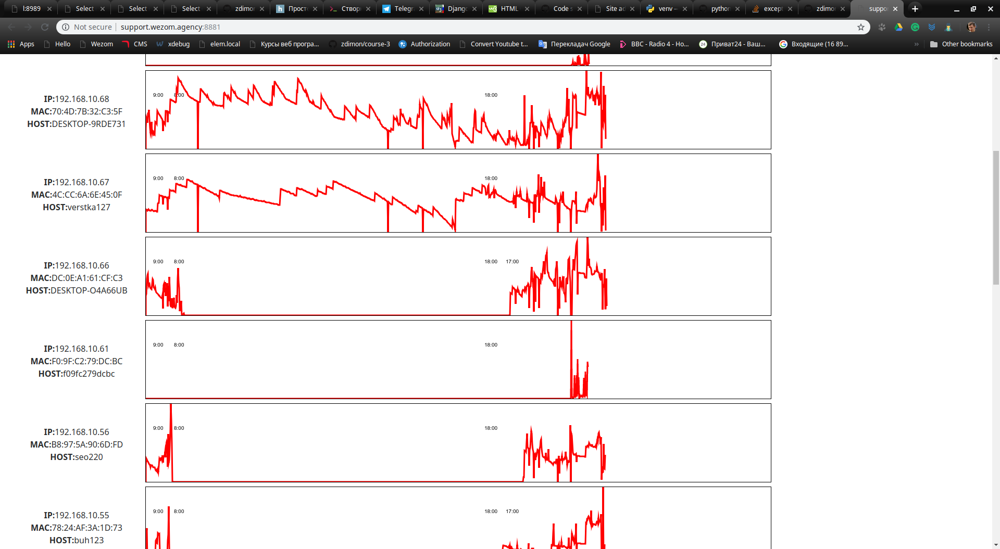

# Задача

Есть 3 файла логов, которые могут быть запрошены из роутера Mikrotik следующими коммандами:

    ssh u_remote_stat@192.168.10.1 "ip dhcp-server lease print detail without-paging" > dhcplease.txt
    ssh u_remote_stat@192.168.10.1 "ip firewall connection print detail without-paging" > connount.txt
    ssh -l u_remote_stat 192.168.10.1 'log print detail without-paging where message~"dhcp_stat"'

## Лог выдачи IP адресов по DHCP.

     time=10:04:28 topics=dhcp,info 
       message="dhcp_stat_: dhcp-server-0 deassigned 192.168.10.16 from 
            B0:EB:57:36:85:3F" 

     time=10:04:28 topics=dhcp,info 
       message="dhcp_stat_: dhcp-server-0 assigned 192.168.10.16 to 
            B0:EB:57:36:85:3F" 

     time=10:04:58 topics=dhcp,info 
       message="dhcp_stat_: dhcp-server-0 deassigned 192.168.8.148 from 
            F4:60:E2:F0:4C:E2" 

## Лог состояния сесии IP.

    Flags: X - disabled, R - radius, D - dynamic, B - blocked 
     0 D address=192.168.10.251 mac-address=0C:4D:E9:D2:5A:6D 
         client-id="1:c:4d:e9:d2:5a:6d" address-lists="" server=dhcp-server-0 
         dhcp-option="" status=bound expires-after=2d23h7m last-seen=1d52m59s 
         active-address=192.168.10.251 active-mac-address=0C:4D:E9:D2:5A:6D 
         active-client-id="1:c:4d:e9:d2:5a:6d" active-server=dhcp-server-0 
         host-name="Admins-iMac" 

     1 D address=192.168.10.248 mac-address=D0:50:99:95:3B:A9 address-lists="" 
         server=dhcp-server-0 dhcp-option="" status=bound 
         expires-after=3d16h29m19s last-seen=7h30m40s 
         active-address=192.168.10.248 active-mac-address=D0:50:99:95:3B:A9 
         active-server=dhcp-server-0 host-name="webmaster"  
                

## Лог сетевой активности.

     0  SAC  s  protocol=tcp src-address=192.168.8.59:1643 
                dst-address=18.203.197.172:443 
                reply-src-address=18.203.197.172:443 
                reply-dst-address=193.151.241.65:1643 tcp-state=established 
                timeout=23h59m58s orig-packets=7 orig-bytes=1 804 
                orig-fasttrack-packets=0 orig-fasttrack-bytes=0 repl-packets=8 
                repl-bytes=6 169 repl-fasttrack-packets=0 repl-fasttrack-bytes=0 
                orig-rate=0bps repl-rate=0bps 

     1  SAC  s  protocol=tcp src-address=192.168.10.123:49858 
                dst-address=77.120.103.109:443 
                reply-src-address=77.120.103.109:443 
                reply-dst-address=193.151.241.65:49858 tcp-state=established 
                timeout=23h59m20s orig-packets=40 orig-bytes=12 090 
                orig-fasttrack-packets=0 orig-fasttrack-bytes=0 repl-packets=30 
                repl-bytes=10 241 repl-fasttrack-packets=0 repl-fasttrack-bytes=0 
                orig-rate=0bps repl-rate=0bps 
            
            
## Задачи.

- Сделать комманду импорта этих логов в базу данных.  

- Импортировать логи с заданной частотой.

- Создать связку мак адресов с предоставленным списком пользователей.

- Анализировать логи на предмет сетевой активности в течении рабочего дня.

- Выводить результаты в виде таблицы с графиками.

 

